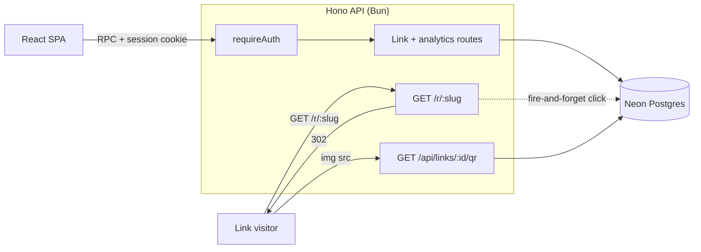
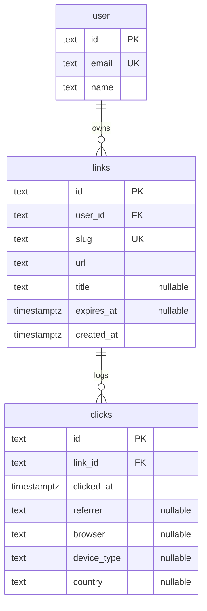

# URL Shortener + Analytics

A full-stack URL shortener: authenticated users create short links, share them, and track every click with per-link analytics — clicks over time, top referrers, and browser/device breakdowns — plus on-demand QR codes and optional link expiry.

Built as a Bun monorepo with **end-to-end type safety**: the React frontend calls the Hono backend through a typed RPC client, so a change to an API route is checked against the frontend at compile time.

## Features

- **Authentication** — email/password sign-up and sign-in via better-auth, with session cookies.
- **Short links** — shorten any URL with an auto-generated 7-character slug or a custom one (`a–z`, `0–9`, `-`). Edit the title/expiry; delete with a confirm.
- **Redirects + click tracking** — `GET /r/:slug` issues a `302` and logs each click (referrer, browser, device type, country) without delaying the redirect.
- **Analytics** — per link: total clicks, a 30-day bar chart, top 5 referrers, and browser/device breakdowns.
- **QR codes** — a public PNG QR code per link, ready to share or print.
- **Link expiry** — optional expiry date; expired links return `410 Gone` instead of redirecting.
- **Rate limiting** — on the public redirect and the auth endpoints to curb abuse.

## Tech stack

| Area     | Tools                                                                      |
| -------- | -------------------------------------------------------------------------- |
| Frontend | React 19, Vite, TanStack Router, TanStack Query, Tailwind CSS v4, Recharts |
| Backend  | Hono on Bun, better-auth, Zod, nanoid, qrcode                              |
| Database | Neon (PostgreSQL), Drizzle ORM                                             |
| Shared   | Zod schemas + a Hono RPC client for end-to-end types                       |
| Tooling  | TypeScript, ESLint, Prettier, Bun test + Vitest                            |

## Prerequisites

- [Bun](https://bun.sh) — package manager and runtime
- A [Neon](https://neon.tech) PostgreSQL database (the free tier is plenty) — you'll need its connection string

## Getting started

```bash
# 1. Install dependencies for all workspaces
bun install

# 2. Create env files from the examples, then fill in the values
cp backend/.env.example backend/.env
cp frontend/.env.example frontend/.env

# 3. Create the database tables from the Drizzle schema
cd backend && bun run db:push && cd ..

# 4. Run the backend (:3000) and frontend (:5173) together
bun run dev
```

Then open <http://localhost:5173>, create an account, and start shortening links. The API is served at <http://localhost:3000> (health check at `/api/health`).

The two apps also run independently:

```bash
bun run dev:backend    # Hono API on :3000
bun run dev:frontend   # Vite dev server on :5173
```

## Environment variables

### `backend/.env`

| Variable             | Description                                        |
| -------------------- | -------------------------------------------------- |
| `DATABASE_URL`       | Neon PostgreSQL connection string                  |
| `BETTER_AUTH_SECRET` | Auth signing secret (`openssl rand -base64 32`)    |
| `BETTER_AUTH_URL`    | Backend base URL (e.g. `http://localhost:3000`)    |
| `FRONTEND_URL`       | Allowed CORS origin (e.g. `http://localhost:5173`) |
| `PORT`               | Backend port (e.g. `3000`)                         |

### `frontend/.env`

| Variable       | Description                                     |
| -------------- | ----------------------------------------------- |
| `VITE_API_URL` | Backend base URL (e.g. `http://localhost:3000`) |

## Scripts

Run from the repo root:

| Command                | Description                      |
| ---------------------- | -------------------------------- |
| `bun run dev`          | Backend + frontend together      |
| `bun run dev:backend`  | Backend only (:3000)             |
| `bun run dev:frontend` | Frontend only (:5173)            |
| `bun run test`         | Run the backend + frontend tests |
| `bun run lint`         | ESLint across the repo           |
| `bun run format`       | Format with Prettier             |
| `bun run format:check` | Check formatting                 |

Backend (`cd backend`):

| Command               | Description                     |
| --------------------- | ------------------------------- |
| `bun test`            | Run the backend test suite      |
| `bun run typecheck`   | Type-check (`tsc --noEmit`)     |
| `bun run db:push`     | Push the schema to the database |
| `bun run db:generate` | Generate SQL migrations         |
| `bun run db:migrate`  | Apply migrations                |
| `bun run db:studio`   | Open Drizzle Studio             |

Frontend (`cd frontend`):

| Command             | Description                   |
| ------------------- | ----------------------------- |
| `bun run test`      | Run the frontend test suite   |
| `bun run typecheck` | Type-check (`tsc -b`)         |
| `bun run build`     | Type-check + production build |

## Architecture

The app is a Bun monorepo with two workspaces — a Hono API (`backend`) and a React SPA (`frontend`) — that share TypeScript types and Zod schemas.

**End-to-end type safety.** The backend exports its router type (`AppType` in `backend/src/index.ts`); the frontend builds its RPC client with `hc<AppType>(…)` (`frontend/src/lib/client.ts`). Because Hono infers request/response types through method chaining, changing a route's shape is type-checked against the frontend at compile time. The same Zod field schemas (`backend/src/lib/schemas.ts`) are imported by the create-link form, so client and server validation can't drift.

**Request flow.**



- **Redirects are fast and never block on analytics.** `GET /r/:slug` looks the slug up, returns `302` (or `404` / `410`), and logs the click with a fire-and-forget insert (`db.insert(...).catch(...)`) — the visitor is never delayed by the write. The User-Agent is parsed into a browser + device type at log time.
- **Public routes live outside the auth boundary.** The redirect and the QR endpoint are mounted so their handlers run before `requireAuth`, keeping short links and printable QR codes usable without a session. Everything else under `/api` requires the session cookie.
- **Rate limiting** sits in front of the redirect and the auth endpoints (in-memory, per-IP) to curb click inflation and brute-force attempts.

**Data layer.** Drizzle ORM over Neon's `neon-http` driver — a stateless HTTP connection, so there's no pool to manage and the five analytics aggregations run concurrently. `clickCount` and the analytics figures are computed per request, not cached on the row.

**Frontend data.** All server state flows through TanStack Query — `['links']` for the list, `['links', id, 'analytics']` for a link's analytics — rather than Router loaders. Mutations invalidate `['links']` to refetch, and a shared retry policy skips 4xx (a `403`/`404` won't fix itself) while retrying transient 5xx/network failures.

## Database schema

Two application tables — `links` and `clicks` — sit alongside the four tables better-auth manages (`user`, `session`, `account`, `verification`).



- **Primary keys** for `links` and `clicks` are cuid2 strings (`createId()`), so link ids are non-guessable — which is what lets the QR endpoint stay public.
- **Cascade deletes**: removing a user deletes their links, and removing a link deletes its clicks (`onDelete: 'cascade'`). Link deletion is a hard delete.
- **Indexes**: `idx_link_user` (`user_id`), `idx_link_slug` (`slug`), and `idx_click_link_at` (`link_id`, `clicked_at`) — the last keeps the analytics range scans cheap.
- **Privacy**: a click stores a coarse `country` (from the `CF-IPCountry` header) but never the visitor's IP address.

Full definitions live in `backend/src/db/schema.ts`.

## API reference

All routes are served from the backend origin (default `http://localhost:3000`). Authenticated routes use the better-auth session cookie, which the frontend RPC client sends automatically (`credentials: 'include'`).

| Method   | Path                       |  Auth   | Description                                                                                       |
| -------- | -------------------------- | :-----: | ------------------------------------------------------------------------------------------------- |
| `GET`    | `/r/:slug`                 | Public  | Redirect to the destination and log a click. `404` if unknown, `410` if expired, otherwise `302`. |
| `GET`    | `/api/links`               | Session | List the current user's links, each with a `clickCount`.                                          |
| `POST`   | `/api/links`               | Session | Create a short link.                                                                              |
| `PUT`    | `/api/links/:id`           | Session | Update a link's `title` / `expiresAt` (slug and URL are immutable).                               |
| `DELETE` | `/api/links/:id`           | Session | Delete a link (its clicks cascade).                                                               |
| `GET`    | `/api/links/:id/analytics` | Session | Aggregated click data for the charts.                                                             |
| `GET`    | `/api/links/:id/qr`        | Public  | PNG QR code for the link — public so it stays shareable/printable.                                |
| `*`      | `/api/auth/**`             | Public  | better-auth (sign-up, sign-in, sign-out, session).                                                |
| `GET`    | `/api/health`              | Public  | Health check (`{ "status": "ok" }`).                                                              |

**Ownership:** the link routes confirm the link belongs to the caller. A link owned by someone else returns `403 FORBIDDEN` — never `404` — so link ids aren't leaked.

### Create a link — `POST /api/links`

```json
{
  "url": "https://example.com/some/long/path",
  "slug": "my-link",
  "title": "My link",
  "expiresAt": "2030-01-01T00:00:00.000Z"
}
```

- `url` — **required**, must be `http(s)`.
- `slug` — optional, must match `[a-z0-9-]{3,32}`; a 7-character slug is generated if omitted.
- `title` — optional, ≤ 100 characters.
- `expiresAt` — optional, ISO 8601 datetime.

A taken custom slug returns `409` with code `SLUG_TAKEN`.

### List links — `GET /api/links`

```json
{
  "links": [
    {
      "id": "tz4a98xxat96iws9zmbrgj3a",
      "slug": "my-link",
      "url": "https://example.com/some/long/path",
      "title": "My link",
      "shortUrl": "http://localhost:3000/r/my-link",
      "expiresAt": null,
      "clickCount": 42,
      "createdAt": "2026-06-01T12:00:00.000Z"
    }
  ]
}
```

`clickCount` is computed per request with a `COUNT` sub-query; it isn't stored on the row.

### Analytics — `GET /api/links/:id/analytics`

```json
{
  "totalClicks": 128,
  "daily": [{ "date": "2026-06-01", "count": 12 }],
  "referrers": [{ "referrer": "Direct", "count": 30 }],
  "browsers": [{ "browser": "Chrome", "count": 80 }],
  "devices": [{ "deviceType": "Mobile", "count": 64 }]
}
```

`daily` contains only the days that had clicks within the last 30 (the chart fills the gaps with 0). A null referrer is surfaced as `"Direct"`, and `referrers` is capped at the top 5.

### Errors

Every API error uses the same structured body:

```json
{ "error": "Human-readable message", "code": "MACHINE_CODE" }
```

Common codes: `VALIDATION_ERROR` (400), `UNAUTHORIZED` (401), `FORBIDDEN` (403), `NOT_FOUND` (404), `SLUG_TAKEN` (409), `RATE_LIMITED` (429), `INTERNAL_ERROR` (500).

### Rate limits

| Scope                                         | Limit                       |
| --------------------------------------------- | --------------------------- |
| `GET /r/:slug` (redirect)                     | 60 requests / minute per IP |
| `POST /api/auth/*` (login / register)         | 10 requests / minute per IP |
| Link writes (`POST` / `PUT` / `DELETE` links) | 60 requests / minute per IP |

## Testing

Tests are intentionally lightweight and focus on the important business logic.

- **Backend** (`cd backend && bun test`) — Bun's built-in test runner. Covers slug/URL validation, User-Agent parsing, the redirect handler (404 / 410 / 302 + click logging), link ownership (`403` vs `404`), the analytics breakdown mappers, and a create → redirect → analytics integration test. DB calls are stubbed, so no database is required.
- **Frontend** (`cd frontend && bun run test`) — Vitest + Testing Library (jsdom). Covers the create-link form validation, analytics rendering (chart gap-fill, referrer and breakdown tables), and the empty/error states.

> The 30-day analytics SQL aggregation is validated against a real database rather than unit-tested; the backend suite itself runs without one.

Run everything from the repo root with `bun run test`.

## Project structure

```text
url-shortener/
├── backend/
│   ├── src/
│   │   ├── index.ts          # Hono app: middleware, route mounts, error handling
│   │   ├── routes/           # links (CRUD + analytics), redirect, qr
│   │   ├── db/               # Neon + Drizzle client and schema (links, clicks, auth)
│   │   └── lib/              # auth, middleware, rate limiting, validation, analytics
│   └── tsconfig.json
├── frontend/
│   ├── src/
│   │   ├── components/       # LinkCard, CreateLinkForm, ClickChart, QrModal, states…
│   │   ├── routes/           # file-based: /, /login, /dashboard, /links/new, /links/$id
│   │   ├── hooks/            # TanStack Query hooks (links, analytics)
│   │   ├── lib/              # RPC client, auth client, query helpers, utils
│   │   └── index.css         # Tailwind v4 + design tokens
│   └── tsconfig*.json
├── eslint.config.mjs
├── tsconfig.base.json        # shared TS config, extended by both apps
└── package.json              # Bun workspaces
```

## Notes

- `frontend/src/routeTree.gen.ts` is generated by the TanStack Router Vite plugin and is git-ignored. It's created the first time you run `bun run dev` or `bun run build` — `frontend` type-checking depends on it.
